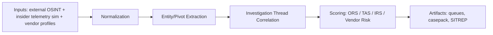

# Architecture Overview

## Pipeline

Inputs -> normalization -> correlation -> scoring -> artifacts

## Components

- **Inputs:** fixture-first collectors and ingest endpoints.
- **Normalization:** common alert/entity representation, dedup, source metadata.
- **Correlation:** SOI thread engine with reason-coded pair evidence.
- **Scoring:** explainable weighted scoring across operational, threat, insider, and vendor dimensions.
- **Artifacts:** analyst outputs for triage and escalation (`/analytics/*`, casepack, SITREP).

## Evidence and accountability

- reason codes
- pair evidence
- provenance keys
- mutation audit trail (`audit_log`)
